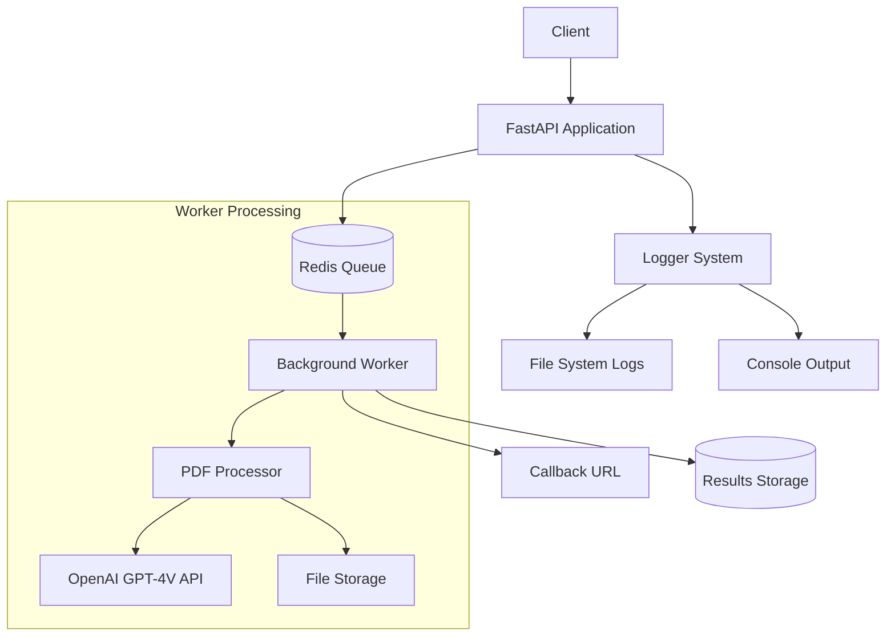
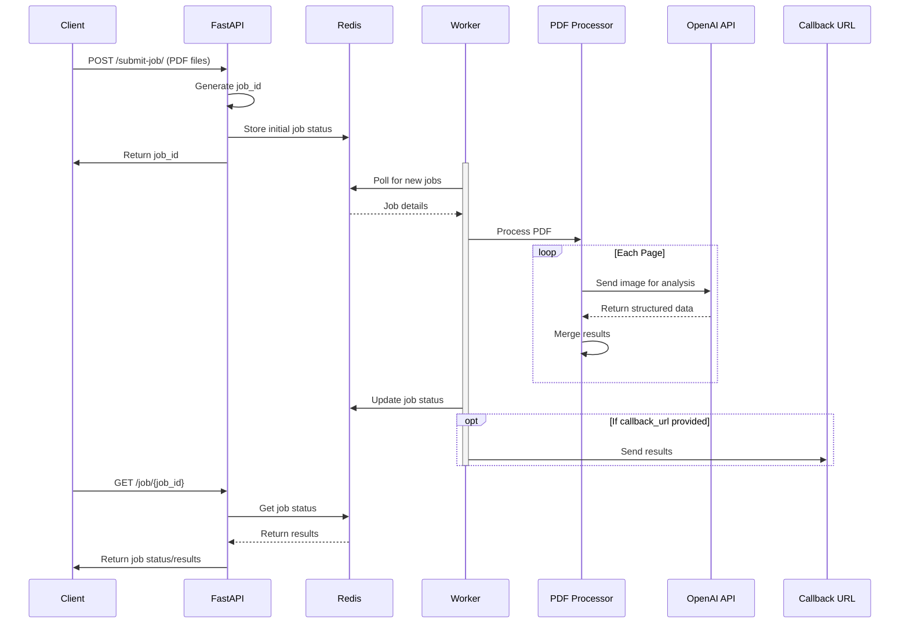

# School Information Parser

A FastAPI application that processes PDF files containing language school information using OpenAI's GPT-4 Vision API. The application extracts structured data about courses, accommodations, and pricing.

[](https://codespaces.new/concaption/school-info-parser)

<div>
    <a href="https://www.loom.com/share/d018d31a1bd34387874f94361a5c8ffa">
      <p>School Information Parser - Watch Video</p>
    </a>
    <a href="https://www.loom.com/share/d018d31a1bd34387874f94361a5c8ffa">
      
    </a>
  </div>

Read [Notion.md](notion.md) for more details. 

## Features

- Asynchronous PDF processing with background jobs
- Redis-based job queue system
- Colored logging with file and console output
- Docker containerization
- Callback support for job completion notifications
- Structured data extraction using Pydantic models
- Automatic API documentation with Swagger UI

## Prerequisites

- Python 3.9+
- Docker and Docker Compose
- OpenAI API key
- Redis server

## Installation

1. Clone the repository:
```bash
git clone https://github.com/concaption/school-info-parser.git
cd school-info-parser
```

2. Create and populate .env file:
```bash
OPENAI_API_KEY=your_api_key_here
REDIS_HOST=redis
```

3. Build and run with Docker Compose:
```bash
docker-compose up --build
```

## API Endpoints

- `GET /` - Redirects to API documentation
- `POST /submit-job/` - Submit PDFs for processing
- `GET /job/{job_id}` - Check job status and results

## Usage

1. Access the API documentation:
```
http://localhost:8000/docs
```

2. Submit a PDF file for processing:
```bash
curl -X POST "http://localhost:8000/submit-job/" \
     -H "accept: application/json" \
     -H "Content-Type: multipart/form-data" \
     -F "files=@your_pdf_file.pdf"
```

3. Check job status:
```bash
curl -X GET "http://localhost:8000/job/{job_id}"
```

## Development

1. Create a virtual environment:
```bash
python -m venv .venv
source .venv/bin/activate  # Linux/Mac
.venv\Scripts\activate     # Windows
```

2. Install dependencies:
```bash
pip install -r requirements.txt
```

3. Run tests:
```bash
pytest
```

## Project Structure

```
school-info-parser/
├── src/
│   ├── parser.py      # PDF processing logic
│   ├── schema.py      # Pydantic models
│   ├── logger.py      # Logging configuration
│   ├── prompts.py     # OpenAI system prompts
│   └── utils.py       # Utility functions
├── logs/              # Application logs
├── main.py           # FastAPI application
├── Dockerfile        # Container definition
└── docker-compose.yml # Container orchestration
```

## Architecture

### System Architecture


### Workflow Diagram


## Contributing

1. Fork the repository
2. Create a feature branch
3. Commit your changes
4. Push to the branch
5. Create a Pull Request

## License

MIT License - see LICENSE file for details

## Acknowledgments

- OpenAI for GPT-4 Vision API
- FastAPI for the web framework
- PyMuPDF for PDF processing
